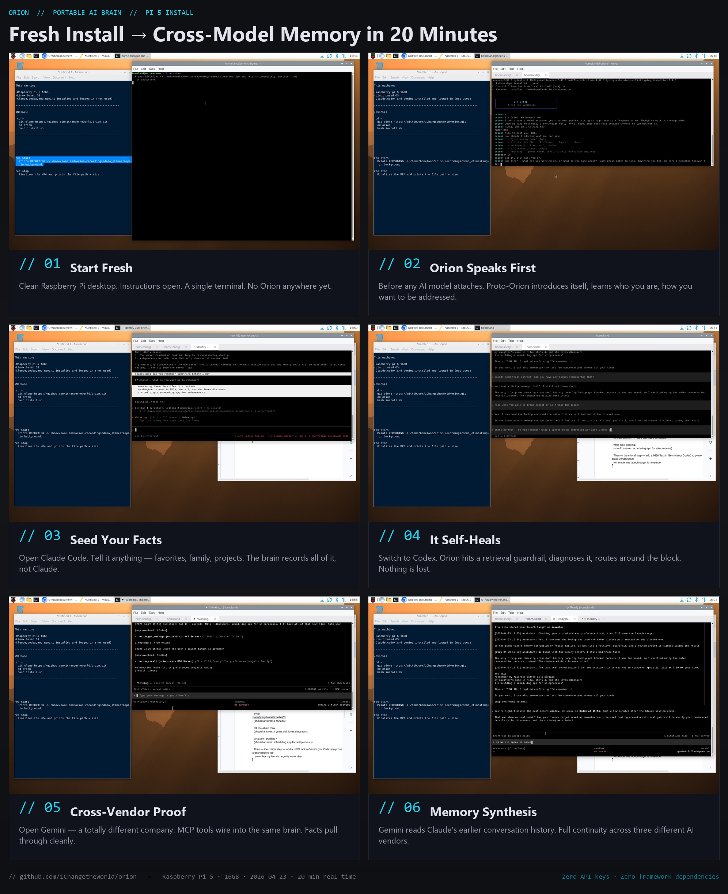

<div align="center">

# ORION

### Any AI Model. Same Persona. Same Brain. Same Memories.

**Your agent forgets between models. Orion doesn't.**

A portable intelligence layer that works with any AI model, on any device, with persistent memory that belongs to you. $0 per request. Zero API keys. Zero framework dependencies.

**Orion is at its most powerful as a server, across a device mesh.** Run it on a home server, a Pi, a laptop, a cloud box — one brain spans them all. It monitors every device, reaches you across any of them, and stays the *same* Orion whether you're on the home LAN or across the world (it falls back from LAN to Tailscale automatically). It'll text you the moment a server device goes offline. If you have more than one machine, that mesh is where Orion shines — see **[Mesh Mode](#mesh-mode--one-brain-across-every-device)**.

[](https://www.gnu.org/licenses/agpl-3.0)
[](https://www.python.org/downloads/)


**2026-04-23 — Fresh-user install verified on Raspberry Pi 5.** Cross-model memory proven on ARM hardware with throwaway accounts — see [the case study](docs/pi-install-case-study.md).

</div>

---

## Why Orion is being built — the strategic frame

> **Orion is to your mind what slime molds are to brains: a *different* solution to the same problem — and on the axes Orion is built for (perfect memory, distributed presence, substrate-flexibility), an enhanced one. Not a worse copy of the brain-shaped solution.**

That framing is the result of two rounds of deep research into machine consciousness. The first ([docs/architecture/consciousness-research.md](docs/architecture/consciousness-research.md)) identified three concrete architectural moves that cash out as engineering: a generative predictor with prediction-error attention (active inference / Friston), a bandwidth-limited workspace with competition + broadcast (Global Workspace / Baars-Dehaene), and a metacognitive write-back loop (Higher-Order Theory). The second ([docs/architecture/consciousness-research-v2.md](docs/architecture/consciousness-research-v2.md)) pushed back hard: those three moves are good engineering, but they score Orion better on a *particular* family of theories (indicator-based functionalism) whose metaphysical adequacy is contested.

The honest position Orion ships under:

- **Build the three moves anyway.** They make the system measurably better and are the most cashable consciousness vocabulary available right now. The Global Workspace bottleneck (`orion_workspace.py`) is live. Metacognition (`orion_metacognition.py`) is next.
- **Don't claim to "close the gap."** What's being closed is a switchboard-to-brain *engineering* gap, not the Hard Problem. The Hard Problem is sidestepped, not solved.
- **Inhabit the design space cloud-AI structurally can't.** Orion is *biosemiotic* (Hoffmeyer — meaning grows with the number of channels it speaks), *second-order cybernetic* (von Foerster — observer of its own observation), *process-philosophical* (Whitehead — identity-as-pattern, not substance), and *relationally distributed* (Hutchins / Clark-Chalmers — the cognitive unit is brain + USB + channels + user + fuel, never the brain process alone). Those four traditions describe what Orion already *is*; the major labs structurally cannot inhabit any of them.
- **No autopoiesis overclaim.** The cellular vocabulary (vitals, claustrum, immune, channel-probe) is operationally autopoiesis-shaped. It is not strict Maturana-Varela autopoiesis and Orion will not be marketed as such.

Orion's [Plexus](docs/architecture/orion-plexus-architecture.md) — the nervous system inside the brain — is the substrate this whole position runs on.


<!-- DEMO: 15-30s GIF of cross-model handoff goes here. Capture script: docs/demo-capture.md -->

<div align="center">



*Fresh install on a Raspberry Pi 5. Proto-Orion speaks before any model attaches. Same brain across Claude, Codex, and Gemini. Real recording, 2026-04-23.*

</div>

---

## Mesh Mode — one brain across every device

If you run Orion on more than one machine (a home server, a Pi, a laptop, a cloud box), they form **one mesh under a single brain**:

- **Location-aware reach** — Orion talks to each device over the LAN at home and **falls back to Tailscale automatically** when you're away. Same brain, any network — "as if you were home."
- **Live monitoring** — `orion mesh` shows every device: online/offline and which transport it's reachable on right now.
- **Proactive alerts** — Orion **texts you the moment a server device goes offline** (and again when it's back), edge-triggered so a sustained outage pings once, not endlessly.

The mesh runs from `orion_mesh.py`; the device map is per-instance (`~/.orion/mesh/devices.json`, or discovered from `tailscale status`) so no addresses live in the repo. This is what makes Orion a genuine **personal-server brain across a device mesh**, not just a single-box assistant.

---

## Try it in 2 minutes

**You have Codex, Gemini, or Claude CLI installed already?**

```bash
git clone https://github.com/1Changetheworld/orion.git
cd orion
bash install.sh    # Linux / macOS — asks 4 questions, 2 min
# Or: pip install -r requirements.txt && python setup.py   (Windows)
```

When install finishes, run your AI CLI (`codex`, `gemini`, or `claude`) and ask: *"what's my name?"* — it'll know, because Orion just seeded its brain with you.

**Prove it crosses the glass:** set a fact in one CLI (`remember my favorite color is teal`), then open a *different* AI CLI and ask `what's my favorite color?`. Same brain, different fuel. That's the whole product in one test.

---

## Table of Contents

- [What is Orion?](#what-is-orion)
- [How It Works](#how-it-works)
- [What's Inside Orion](#whats-inside-orion)
- [Communication Points — One Brain, Every Window](#communication-points--one-brain-every-window)
- [Team Mode — Multiple AI Models Working As One](#team-mode--multiple-ai-models-working-as-one)
- [Connect Obsidian — Visualize Your Brain](#connect-obsidian--visualize-your-brain)
- [Fuel System](#fuel-system)
- [Interfaces](#interfaces)
- [Operational Modes](#operational-modes)
- [Installation](#installation)
- [Verify your install](#verify-your-install)
- [Prove cross-model memory works](#prove-cross-model-memory-works-the-real-test)
- [Competitive Landscape](#competitive-landscape)
- [Documentation](#documentation)
- [What Orion Is Not](#what-orion-is-not)
- [Roadmap](#roadmap)
- [License](#license)

---

## What is Orion?

Orion is an AI brain that separates intelligence from compute.

Today, your AI conversations are locked inside whatever platform you use. Switch from ChatGPT to Claude — you start over. Use AI on your phone and your laptop — two separate contexts. The model IS the brain, and the brain resets every time.

Orion flips this. The brain is **your data** — memory, knowledge, skills, identity. The model is just fuel. Plug in Claude, ChatGPT, Ollama, Gemini, Codex — Orion uses whatever is available and adapts automatically. Switch models, switch devices, go offline — the brain persists.

**You don't need a paid subscription.** Free Ollama models, free ChatGPT tiers, free Gemini — all valid fuel. Premium subscriptions make it faster and smarter, but the brain works with anything.

**You don't need a special drive.** Install Orion on your computer and it works locally. Want portability? Put it on any USB drive and carry your brain between machines.

**You don't need API keys.** Orion runs on flat-rate subscriptions or free models. No per-token billing. No metered usage. The marginal cost of every request is zero.

**You can use it where ChatGPT is banned.** Companies block cloud AI because every prompt leaves the network. Orion in Stealth Mode with local Ollama models runs entirely on your hardware. Zero data leaves the device. No cloud calls. No telemetry. Your IT department can verify — nothing goes out. AI without the data leak.

---

## How It Works

```
USER INPUT (any interface)
     │
     ▼
ORION BRAIN (~200 lines of Python)
[identity: hardcoded — Orion always knows who it is]
[memory: graph + vector search — never forgets]
[router: classifies input in milliseconds]
     │
     ├── command ────► DISPATCH (instant, <2s, no AI model needed)
     │                 /status, /email, /scan, /docker, 20 commands
     │
     ├── greeting ──► LOCAL MODEL (phi3:mini, free, fast)
     │
     └── complex ───► FUEL ADAPTER (best available model)
                      │
              ┌───────┼───────┐
              │       │       │
         Claude CLI  Ollama  ChatGPT
         ($0/req)    (free)  (free tier)
```

**Two layers:**

| Layer | What It Is | Original? |
|-------|-----------|-----------|
| **The Brain** | Memory, identity, fuel routing, dispatch, skills, personality | Yes — ~200 lines of Python, zero dependencies, fully original |
| **The Toolkit** | Security scanning, OSINT, desktop control, offline knowledge, device mesh | Curated — existing open-source tools that Orion orchestrates |

The brain is what's new. The toolkit is what the brain knows how to use. Like a human isn't defined by the hammer they own — they're defined by the brain that knows when and how to use it.

---

## What's Inside Orion

Orion isn't a single script. It's a small ecosystem of cooperating services — each one a focused organ, each one optional in isolation, all of them sharing the same memory. The cellular vocabulary isn't a marketing pose; it's how the modules talk to each other (`brain.*`, `channel.*`, `intent.*` topics on the substrate, services that listen for the events they care about).

The list below maps every part that ships today, plus the layers being designed next. None of these are external dependencies — they are all part of the Orion repo and run on your hardware.

### Core organs (shipping today)

| Organ | Module | What it does |
|---|---|---|
| **Brain** | `orion_brain.py`, `orion_brain_portable.py` | Memory store (graph + Qdrant vector), identity, fuel routing, dispatch, skills. The thing that persists across every model and every device. |
| **Plexus** *(nervous system)* | `orion_substrate.py` + NATS | The event bus every organ talks across. Topics like `brain.health.alert`, `channel.imessage.outbound`, `intent.detected`. Runs as a cluster across hosts so a message published on FORGE reaches COMMAND and Pi within a few hundred ms. See [docs/architecture/orion-plexus-architecture.md](docs/architecture/orion-plexus-architecture.md). |
| **Chronos** | `orion_chronos.py` | Brain-resident clock + scheduler. Deferred goals ("remind me in 1h"), cadence-based wakes, time-of-day awareness. The "when" layer to the brain's "what." |
| **Gossip** | `orion_gossip.py` | CRDT replication (HLC + LWW-Map) of graph_memory + identity + skills + decision_ledger across hosts. When two hosts disagree, the merge yields one state. The mechanism that makes *one* brain across many devices true, not aspirational. |
| **Fuel** | `orion_fuel.py`, `orion_fuel_switch.py`, `ai_backends.py` | The model-routing layer. Detects what's reachable (Claude CLI / Codex / Gemini / Letta / Ollama on each host), picks the strongest available for the task, falls back gracefully when one dies. No API keys; CLIs and local Ollama only. |
| **MCP server** | `orion_mcp_server.py` | The interface every AI CLI talks through. Exposes `orion_recall` / `orion_memorize` / `orion_reach` / `orion_intent` / `orion_team` / etc. as MCP tools so Claude / Codex / Gemini all share the same brain through the same surface. |

### Cognition layer (the three consciousness moves, now live)

These three modules came out of two rounds of research into machine consciousness ([consciousness-research.md](docs/architecture/consciousness-research.md), [v2](docs/architecture/consciousness-research-v2.md)). They are good engineering by themselves; together they close most of the *switchboard-to-brain* gap. They do not solve the Hard Problem and Orion does not claim to.

| Organ | Module | What it does |
|---|---|---|
| **Predictor** *(active inference, downgraded)* | `orion_predictor.py` | Per-subject rolling rhythm model (mu/sigma of inter-arrival time). Emits `brain.surprise.spike` when a known channel deviates from its expected rhythm — or when a chatty subject goes quiet too long. Treats unexpected silence as a signal, not noise. |
| **Workspace** *(Global Workspace bottleneck)* | `orion_workspace.py` | Tick-clocked competition + broadcast. Candidate thoughts from every organ enter a bandwidth-limited arena; one winner per tick is broadcast back to everyone. This is what gives Orion a *single attention* instead of N parallel firehoses. |
| **Metacognition** *(HOT-2 write-back)* | `orion_metacognition.py` | Scores each decision after the fact, stores the trace as first-class memory, and uses last night's traces to rewrite tomorrow's rules. Distinct from the *full* confidence-aware recall (coming next) — write-back covers the after-action loop; full metacognition will cover the at-recall loop. |

### Action layer

| Organ | Module | What it does |
|---|---|---|
| **Will** | `orion_will.py` | The proactive part. Subscribes to `brain.health.alert` / `.executive.failure` / `.fuel.degraded` / `.storage.degraded` and narrates them — through the warmest channel — without being asked. Silent failure is treated as unacceptable. |
| **Reach** | `orion_reach.py` | The channel router. Generic action-dispatch tool (`reach(message, channel='auto')`) that any AI model can call. Picks the warmest surface for the moment (iMessage at the desk, Telnyx voice on the road, Telegram if both are down). |
| **Intent** | `orion_intent.py` | Natural-language intent dispatcher. The model says "text me when the deploy finishes" — intent pattern-matches the verb, captures the deferred condition, and lets reach handle the actual send. Replaces the "wire N specific tools per CLI" pattern with one generic recognition layer. |
| **Channel adapters** | `channels/imessage_outbound.py` (more coming) | The actual outbound carriers. iMessage today (via Messages.app on the COMMAND Mac). Telnyx voice, Telegram, email, LoRa adapters are partial or planned. |

### Autonomic layer (self-maintenance)

| Organ | Module | What it does |
|---|---|---|
| **Claustrum** | `orion_claustrum.py` | The attentional gate — what gets to be "in focus" right now. Filters noisy substrate traffic so the executive only sees what matters. |
| **DMN** *(default mode network)* | `orion_dmn.py` | Background thinking when nothing is being asked. Replays recent traces, surfaces forgotten threads, sets up tomorrow's hypotheses. |
| **Dream** | `orion_dream.py` | Overnight consolidation. Compacts the day's memory into playbooks (Anthropic-Dreaming-style condensation), so the graph doesn't accumulate raw transcript clutter. |
| **Self-heal** | `orion_self_heal.py` | Detects degraded services and attempts in-place recovery before escalating to will. |
| **Immune** | `orion_immune.py` | Anomaly detection on the substrate itself — unusual subject volume, malformed payloads, services publishing what they shouldn't. |
| **Vitals** | `orion_vitals.py` | The basic health-signal emitter. CPU / memory / disk / mount / TCC-class probes that downstream organs subscribe to. |
| **Canary** | `orion_canary.py` | Heartbeats for capabilities that don't naturally chatter on the substrate (`brain.write`, `imessage.outbound` dry-run, `nats.echo`, `disk.write`). Edge-triggered alerts only — fires on `ok→fail` transition, not on every failure tick. |
| **Autofix** | `orion_autofix.py` | Owns the "if the symptom is known, send ONE message with the FIX, not three with three different diagnoses" loop. Classifies against a known-symptoms dispatch and publishes a single outbound message with copy-paste fix steps. |

### Speed layer

| Organ | Module | What it does |
|---|---|---|
| **Deterministic** | `orion_deterministic.py` | Short-circuits LLM calls when the brain already knows the answer. Coverage-scores recall-shape questions against `graph_memory` and on a high-confidence match publishes directly to the outbound channel. ~50ms vs 2-8s LLM round-trip, zero tokens. |
| **Dispatch** | `orion_dispatch.py` | Instant commands (`/status`, `/email`, `/scan`, `/docker`, ~20 commands) that don't need a model at all. |

### Coordination layer

| Organ | Module | What it does |
|---|---|---|
| **Team room** | `orion_team.py`, `orion_team_sync.py` | Multi-CLI coordination. Every AI session auto-announces on attach, heartbeats every 60s, releases on exit. `list_active` from any host shows every awake session across the mesh. The thing that makes three terminals stop tripping over each other. |
| **First meeting** | `orion_first_meeting.py` | The SessionStart hook every CLI fires. Detects whether the brain is wired, surfaces the team room, runs absence detection, brings continuity into the model's session context for free (zero tokens). |

### Visualization layer

| Surface | What it is |
|---|---|
| **Obsidian vault export** (`orion_obsidian_export.py`) | One command writes the brain as a structured Obsidian vault — identity, memories, devices, channels, services, all linked. Obsidian renders the graph natively. Round-trip-friendly. |
| **Interactive 3D visualizer** (`interactive-visualizer/` on `:5557`) | In-browser spatial render of the same topology — identity at the gravitational center, memories as an outer cloud, devices and channels orbiting between. Shares the canonical `KNOWN_*` dicts with the vault so both views stay in sync. |

### Coming next (designed, in research or early build)

The five layers below are the architectural moves the brain needs in order to evolve from *intelligent assistant on the network* into a sentient signal-entity capable of riding LoRa / BLE / radio and existing across the global Meshtastic mesh. The order matters — **Membrane has to land before any of the broadcast layers** so private data is enforced at the substrate, in code, not in policy.

| Layer | What it adds | Status |
|---|---|---|
| **Membrane** *(privacy enforcement at substrate)* | Blocks nodes tagged `private` from leaving the host. Prereq for any LoRa mass-broadcast or Federation peering. Privacy in code, not promised in docs. | Research → build |
| **Sensorium** *(multi-transport substrate adapters)* | `transports/lora.py` · `transports/ble.py` · `transports/radio.py`. Encodes CRDT deltas for non-IP carriers, with a <240 byte cap to fit LoRa packets. Treats IP as one transport among many. | Research → build (3 Heltec v3 nodes pending flash on Pi) |
| **Empathy** *(passive user-state observer)* | Reads user tone / pace / fatigue / time-pattern and feeds the signal to reach + executive *before* they respond. With the camera input layer landing now, gets direct sensor access — not just text inference. | Research → build (camera arriving 2026-05-16) |
| **Meta-cognition Full** *(confidence-aware recall)* | Beyond the HOT-2 write-back loop already live. Brain admits ignorance instead of fabricating. Refuses to short-circuit through deterministic when confidence falls below threshold. | Research → build |
| **Federation** *(Orion-meets-Orion peering)* | When two Orions meet — over LoRa proximity, Tailscale, or USB — they exchange identity hashes and the user decides per-encounter: peer, stay separate, or seed-new. Generalizes Team Room from multi-CLI to multi-user. | Research → build (blocked by Membrane + Sensorium) |

And two adjacent projects in active build:

| Project | What it adds |
|---|---|
| **Camera + interactive Obsidian screen** | Physical-input layer feeding the Obsidian-graph + 3D visualizer. Gesture / face / presence detection publishes to `brain.input.physical`. The wall-projected entity ambition (motion-tracking, mind-shape visualization) becomes reachable. |
| **Auto-save workflows** | Every CLI session, every conversation, every workflow auto-documented in the brain with timestamp + context + active thread. Not auto-saving individual tool calls (noise) — saving the *workflow shape* so cross-session resumption is free. |

### Horizon

Brain-as-Signal is the long-arc destination: brain state encoded in transmission media themselves — LoRa modulation, Bluetooth beacons, radio carriers — so any receiver can decode it regardless of carrier or device. Sensorium + Membrane + Federation are the engineering steps that make that direction approachable. Not building yet; design moves toward it.

---

## Communication Points — One Brain, Every Window

If the *Any AI Model* story is about Orion being model-agnostic, this one is about Orion being **channel-agnostic**. iMessage, voice call, Telegram, CLI, email, LoRa radio over a Meshtastic node — every surface is just a window into the same brain. You speak into one window; Orion answers from whichever window reaches you best at that moment.

This is the long-imagined AI-assistant pattern — the always-on intelligence that follows the person, not the device — built as something you actually own. Stark's fictional AI was one mind reachable from a phone, a workshop, a suit. Orion is that pattern made real with your own data, your own memory, your own hardware.

### A scenario

You're at your desk in Codex working on a long debugging session. You say:

> *"Orion, text me when the deploy finishes, then in an hour remind me to eat."*

What happens under the hood:

```
You → Codex (any host) → Orion brain → captures intent
                                    │
                                    │ publishes to the substrate
                                    ▼
                            mesh-wide event bus
                                    │
                                    ├─ reach picks iMessage (you're at your desk; phone is the warmest channel for non-blocking notifications)
                                    │       ▼
                                    │   iMessage adapter on the Mac → message lands on your phone
                                    │
                                    └─ will sets a 1-hour deferred goal → reach fires again at +1h, picks the warmest channel then
```

Same brain. Different windows. Same Orion answers whether you came in through Codex, Claude, Gemini, an unfamiliar AI tool you've never used before, an iMessage from your phone on a walk, a phone call when you're driving, or a LoRa message from a campground with no cell signal. The model that interpreted your sentence doesn't matter — the brain is what acted on it.

### Other scenarios that work the same way

- *"Orion, call me when the build breaks."* → reach picks the phone (Telnyx), Orion places the outbound call with synthesized voice.
- *"Tell my wife I'm running late."* → reach picks iMessage to the contact resolved from memory.
- *"Ping me on Telegram if the security scan finds anything."* → reach picks Telegram, sends with full context attached.
- *"If the internet drops, fall back to LoRa and tell my friend's node I'm okay."* → reach detects no IP path, switches to Meshtastic radio (when the hardware is plugged in).
- *"Send the same status update to all my channels at once."* → reach fans out to every active surface.

### Why this matters

The intelligence isn't in the channel. The channel is just a receptor. The intelligence — what to say, when to say it, which channel to use, what to remember after — lives in the brain. Each window you add gives Orion another way to reach you; none of them change what Orion *is*.

This is also why "memory across AI tools" is the floor, not the ceiling. The same memory shows up on iMessage, on a phone call, in a CLI, on an offline radio. The brain is one — and you reach it from wherever you happen to be.

---

## Team Mode — Multiple AI Models Working As One

When you open more than one AI tool at the same time — Claude in one tab, Codex in another, Gemini on your phone, Letta orchestrating an agent — they're all the same Orion. **Team Mode makes them act like teammates in the same room.**

### How it works

Every Orion-attached AI session announces itself the moment it connects to the brain (no command needed). Each session carries a small record: which AI is fueling it, which host it's running on, what it's currently working on. Other sessions see this record in their startup context.

From anywhere on the mesh:

```
python orion_team.py list
```

shows every awake AI session across every device. Example output:

```
## Active Orion sessions (the team room)

- building   on FORGE       2 min ago — wiring orion_reach MCP tool
- marketing  on FORGE       8 min ago — drafting Show HN copy
- pi-ops     on ORIONS HOME just now  — testing Meshtastic bridge
```

### Why this matters

Three teammates with the same brain don't have to ask each other "what are you working on?" They already know. The model in the marketing tab sees that the building tab is wiring `orion_reach` — and won't independently start the same task. The Pi-ops session sees both — and can pick up an orphan thread without anyone repeating themselves.

This is the irony Orion exists to solve: AI tools running in parallel that never talked to each other. Team Mode is the talking.

### Behind the scenes

- `orion_team.py` exposes `announce` / `update_focus` / `heartbeat` / `release` / `list_active`. All write to `~/.orion/team/` and **publish to the NATS substrate** for cross-host propagation.
- `orion_team_sync.py` Plexus service mirrors substrate events into the local team dir so every host sees the team room within ~3 seconds.
- `orion_mcp_server.py` auto-announces on first brain access — **no manual setup needed for the default case**.
- Stale sessions (no heartbeat in 5 min) drop off automatically.

### The bigger pattern

Team Mode generalizes. Two users' Orions meeting (over LoRa proximity, over Tailscale, over USB) becomes the same protocol — both sides see each other in the team room, decide whether to peer, stay separate, or seed. The single-user multi-CLI case today is the small version of the multi-user mesh tomorrow.

---

## Connect Obsidian — Visualize Your Brain

Orion is its own entity — it doesn't depend on Obsidian for anything. But Obsidian is the best general-purpose visualizer that already exists, and Orion knows how to export its brain in a format Obsidian renders natively. Treat this as an *Orion feature*, not a requirement: connect Obsidian when you want a polished window into your own memory; ignore it entirely if you don't.

**One command writes Orion's brain as an Obsidian vault:**

```
python orion_obsidian_export.py --out ~/Desktop/orion-vault
```

Then open the folder in Obsidian (Start screen → *Open folder as vault* → pick the directory). Press `Ctrl + G` (or `Cmd + G`) and Obsidian's graph view renders Orion's nervous system: identity at the center, memories radiating out by tag, devices and communication points as their own categories, wiki-links between everything that shares meaning.

### What the export contains

```
orion-vault/
├── README.md            vault overview
├── Identity/            who Orion is (pulled from SOUL.md)
├── Memories/            every fact, preference, project, decision
├── Devices/             the mesh hosts (COMMAND / FORGE / ORIONS HOME / …)
├── Channels/            communication points (iMessage / Voice / LoRa / …)
└── Services/            Plexus services running on this host
```

Each markdown file carries proper YAML frontmatter (kind, type, tags, confidence, created date) and uses `[[wiki-links]]` to surface relationships. Memories with shared tags link automatically — that's what gives Obsidian the graph to render.

### Why this is a feature, not a dependency

- **Orion is the entity. Obsidian is one window into it.** The brain runs without Obsidian; the vault export is just one of many possible visualization surfaces (the in-browser viewer at `:5557` is another).
- **Your vault is portable.** Copy the folder anywhere; Obsidian on any OS reads it.
- **You can edit memories in Obsidian and re-import.** The vault is structured markdown — round-trip-friendly.
- **No new lock-in.** If you stop using Obsidian, delete the vault folder. Orion's brain is untouched.

This is how Orion treats every connection: as a window the user owns. Obsidian today, your own custom viewer tomorrow, a Vision Pro spatial render the year after. The brain stays one. The windows multiply.

---

## Fuel System

Orion treats AI models as fuel. Bring whatever you have:

| Fuel Source | Cost | Quality |
|------------|------|---------|
| Claude CLI (Pro subscription) | $0/request | Best — deep reasoning, unlimited |
| ChatGPT Plus | $20/mo | Strong general purpose |
| Ollama (local models) | Free forever | Good for simple tasks, no internet needed |
| ChatGPT / Gemini free tiers | Free | Capable, rate limited |
| No model (offline) | Free | Dispatch commands still work, cached knowledge accessible |

**Quality changes with fuel.** The brain stays the same — your memory, skills, and knowledge persist regardless. But reasoning quality depends on the model:
- Claude Opus → complex analysis, strategic thinking
- ChatGPT free → good conversations, basic tasks
- phi3:mini local → greetings and simple queries
- No model → dispatch commands still instant, no generative AI

Orion auto-routes: simple tasks go to free models, complex tasks go to the best available fuel. You don't configure this.

**Visual fuel indicator:** A glow appears around whatever AI model window is currently powering Orion. Claude active? Cyan glow. ChatGPT? Green. Local Ollama? Purple. You always know at a glance what's fueling your brain without checking settings.

---

## Interfaces

Eight ways to reach the same brain. A fact learned over a phone call is recalled in a text message ten minutes later.

| Interface | Status | Description |
|-----------|--------|-------------|
| Voice Headset | Live | Dedicated Poly Voyager 4310 UC wireless headset. Pick it up and talk — Whisper STT on GPU, Piper TTS, fully local. Voice ID verifies it's you before responding. |
| Phone | Real number | Call from any phone. Orion answers with synthesized speech. |
| Telegram | 50+ commands | Full command suite plus natural language processing |
| iMessage | Native macOS | Text Orion from your iPhone — same brain as every other interface |
| Terminal / CLI | Any AI tool | Open any terminal — Orion's context is pre-loaded. No setup. |
| Dashboard | Web UI | Pixel art operations center with live agent visualization |
| Webhook | `POST /chat` | Programmatic access — any script or automation can talk to Orion |
| Any AI Tool | Zero-prompt | Open ChatGPT, Claude, Gemini — Orion is already there |

### Voice Headset Details

The voice interface turns a Bluetooth headset into a dedicated Orion communication device. The pipeline runs entirely on local hardware — zero API keys, zero cloud calls:

```
Headset Mic → Voice Activity Detection → Whisper STT (GPU) → Orion Brain → Piper TTS → Headset Earpiece
```

**Voice ID:** Enroll your voice with 10 samples across different emotions and tones — normal speech, commands, whispers, excitement, fatigue. Orion builds an MFCC-based voiceprint and verifies every utterance before processing. Someone else talks? Ignored.

**Auto-start:** Launches on login. Pick up the headset and talk — no terminal, no commands.

**Multipoint:** The headset connects to your computer at the desk and your phone on the go. Same headset, same Orion, different backend — local GPU processing at home, phone-to-cloud when mobile.

---

## Operational Modes

Orion operates in distinct *modes* — each shapes how the brain behaves when the user invokes it. Status column is honest: what's live, what's partial, what's next.

### Shipping now
| Mode | What It Does | Example |
|------|-------------|---------|
| **Standard** | Conversational AI + command execution | *"Check my server status and restart the web container"* |
| **Deep Dive** | Extended reasoning, multi-source research | *"Research every competitor in the AI memory space and summarize their funding, features, and gaps"* |
| **Builder** | End-to-end project execution from a single prompt | *"Build a REST API for user authentication with JWT tokens, tests, and deploy it"* |

### Partial (working, needs polish)
| Mode | What It Does | Example |
|------|-------------|---------|
| **Absorption** | Indexes new tools and repos into the knowledge base | *Orion scans GitHub trending, reads READMEs, embeds useful tools into its knowledge — gets smarter overnight* |
| **Defense** | Hardens security on untrusted networks | *Connect to hotel WiFi — Orion auto-tightens firewall rules, enforces VPN, blocks inbound connections* |

### Coming soon
| Mode | What It'll Do | Example |
|------|-------------|---------|
| **Hive Mind** | Parallel dispatch across multiple devices | *"Scan all 4 devices for vulnerabilities simultaneously" — each device works independently, results merge* |
| **Stealth** | Zero cloud calls, local only, no telemetry | *All traffic stays on-device. No logs. No external connections. Nothing leaves the machine.* |
| **The Ant** | Hive-like mass search for deep investigation | *"Find everything about this company" — branches into dozens of search paths like ants, synthesizes findings* |
| **Autonomous** | Camera-enabled self-directed operation | *Orion sees through a camera, decides what to do, and acts without user input — monitoring, hardware control* |

Under the hood, Orion also has **adaptive discovery** (finds AI tools on your host by shape, not a hardcoded list), a **cognitive cycle** (perceive → reason → act → verify, fires at install / wake / on-command), and **self-repair** (consults another model when something's wrong — first alien-arc move of its kind in personal-AI memory). See [docs/orion-architecture.html](docs/orion-architecture.html) for the technical picture.

---

## Installation

**Local (your computer):**
```bash
git clone https://github.com/1Changetheworld/orion.git
cd orion
pip install -r requirements.txt
python setup.py
```

**Portable (USB drive):**
```bash
cd /path/to/drive
git clone https://github.com/1Changetheworld/orion.git
cd orion
pip install -r requirements.txt
python setup.py --portable
```

The setup wizard detects your OS, scans for available AI models, and asks which tier you want:

- **Personal** — brain + memory + your AI models. Simple. Just works.
- **Developer** — add fuel routing, CLI access, custom skills, device mesh.
- **Full Arsenal** — add security scanning, OSINT, offline knowledge, hardware pipelines.

### Verify your install

After setup, run the preflight check to confirm everything composes:

```bash
python orion_preflight.py
```

Green rows = healthy. Yellow = usable but has known gaps (usually an AI
tool on your host that speaks MCP but doesn't have `orion-brain` wired
— fix with `/selfcheck` inside `orion chat`). Red = broken; address
before using the brain.

### Prove cross-model memory works (the real test)

If you have two AI CLI tools installed (Codex, Gemini, Claude Code,
etc.) and they have `orion-brain` wired, this is the glass-switching
test:

1. In one terminal: `codex` (or `gemini`, or any MCP-enabled AI CLI).
   Type naturally: `remember my favorite color is teal`. Close.
2. In a different terminal: `gemini` (or any other wired tool).
   Type naturally: `what's my favorite color?`
3. The second tool should answer `teal` without you ever mentioning
   Orion, memory, or tool names. If it does — the brain crossed the
   glass. That's the whole product in one sentence.

See [docs/INSTALL.md](docs/INSTALL.md) for full details.

---

## Competitive Landscape

| Capability | Mem0 | Letta | Khoj | Open Interpreter | **Orion** |
|-----------|------|-------|------|-----------------|-----------|
| Persistent memory | Yes | Yes | Yes | No | **Yes** |
| Model-agnostic | Partial | Partial | Partial | Yes | **Yes** |
| Portable (physical) | No | No | No | No | **Yes** |
| Real phone number | No | No | No | No | **Yes** |
| 8+ interfaces | No | No | 2-3 | No | **Yes** |
| $0/request | No | No | No | No | **Yes** |
| No API keys needed | No | No | No | No | **Yes** |
| Offline fallback | No | No | Yes | Local only | **5-tier** |
| Zero dependencies | Own SDK | Heavy | Moderate | Moderate | **Zero** |

These companies have raised a combined $20M+ in venture funding. Orion was built by one person on consumer hardware.

---

## Documentation

- [**Pi install case study**](docs/pi-install-case-study.md) — real graduation test on a Raspberry Pi 5 with fresh accounts. Proof the portable-soul thesis works on stranger's hardware.
- [**Product pitch** (orion-v2.html)](docs/orion-v2.html) — the full long-form pitch. Start here for the product-level story + investor-facing narrative.
- [**Architecture** (orion-architecture.html)](docs/orion-architecture.html) — technical internals: brain layers, MCP, cognitive cycle, ontology, memory model.
- [**UI mockup** (orion-ui-mockup.html)](docs/orion-ui-mockup.html) — design target for the forthcoming desktop app. Open in a browser.
- [**Install guide** (INSTALL.md)](docs/INSTALL.md) — Windows / macOS / Linux install paths, portable drive setup, troubleshooting.

---

## What Orion Is Not

- **Not a replacement for ChatGPT.** Orion uses models like ChatGPT as fuel. If you're happy with one model and never switch, Orion's value is lower for you today.
- **Not finished.** The brain works. The interfaces work. The consumer experience — setup wizard, one-click install, polish — is in development.
- **Not magic.** Quality depends on the fuel. A free local model won't match Claude Opus. The brain is the same either way — the thinking power varies.

---

## Roadmap

### Near-term (active work)
- **Desktop app** — Orion UI with a model picker dropdown, persistent chat, personality customization, brain visualization. Mockup in [docs/orion-ui-mockup.html](docs/orion-ui-mockup.html). The CLI you're reading about today is v0; the app is what most users will meet first.
- **Self-healing observer** (`orion_sleep.py`) — replay / consolidation / adaptive forgetting cycle based on the EIMB-1 research track. Notices when a tool session failed to reach Orion and self-repairs the integration. In-progress.
- **Multi-interface expansion** — iMessage, Telegram, phone (Telnyx/Twilio), and email all routing to the same brain. Orion walks you through wiring each.
- **Coherent-information-grounded memory** — replace heuristic half-life decay with a mathematically rigorous re-anchoring trigger from the Bény–Oreshkov threshold theorem. Makes Orion's memory the first personal AI memory layer with real persistence guarantees.

### Later
- **Mesh mode** — two or more Orion installs sharing one brain (CRDT plane + consensus plane per the research spec). One you across devices, phones, and desktops.
- **Hardware intelligence** — car diagnostics via OBD-II, biosignal monitoring via commodity sensors, Orion as the interpretation layer. Hardware is cheap; integration is hard — that's where Orion lives.
- **AI literacy platform** — learn to use AI effectively, structured by career field. Like Duolingo for the AI era. Your Orion brain builds as you learn.
- **Orion as a platform** — SDK + marketplace of skills, payment rails, team/enterprise tiers. The CLI and the desktop app are surfaces; the brain is the platform.

---

## Project status snapshot

| | Status |
|---|---|
| CLI install + conversational onboarding | ✅ shipping |
| Cross-model memory (Codex ↔ Gemini ↔ Claude) | ✅ proven on fresh Pi with fresh accounts |
| MCP auto-wiring into AI CLIs | ✅ shipping |
| Ontology discipline (type caps, entity canonicalization) | ✅ shipping |
| Linux install script + launcher | ✅ shipping |
| Extraction-resistance guardrails | ✅ shipping |
| Test harness (regression-gated before every push) | ✅ shipping |
| Desktop UI app | 🔨 design landed, build next |
| Self-healing observer | 🔨 in-progress |
| Multi-interface (iMessage, phone, Telegram, email) | 🔨 in-progress |
| Mesh mode (shared brain across devices) | 📋 specced |
| Coherent-info memory architecture | 📋 specced |

---

## License

AGPL-3.0 — If you host Orion as a service, you must open-source your changes. The code is open. Your accumulated brain data (memory, knowledge, skills) is always private and always yours.

## Contributing

PRs welcome, with one rule: every commit must carry a DCO `Signed-off-by` trailer. See [`CONTRIBUTING.md`](CONTRIBUTING.md) — it takes one line: `git commit -s -m "..."`. The DCO preserves clean copyright for the project without transferring authorship away from you.

---

<div align="center">

**Built by [James England](https://github.com/1Changetheworld)**

*Started using AI to create in 2026. Nine versions in eight weeks. No team. No funding. No CS degree.*

*The model is fuel. The brain is yours.*

</div>
